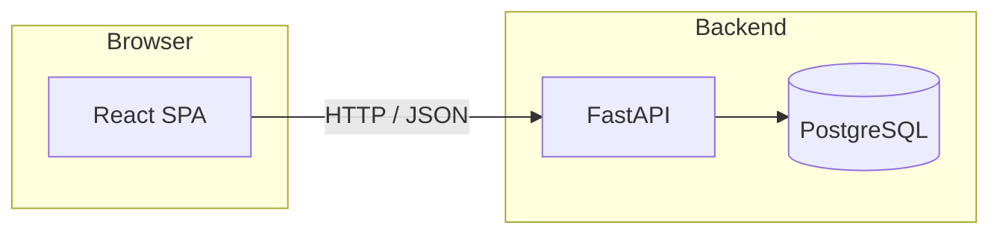

# Architecture

This document describes how the **summercamp-react** repository is structured at a systems level: major components, how they communicate, and where configuration lives. It complements `PROJECT_OVERVIEW.md` (product and integration notes) and `product requirements.md` (feature scope).

---

## 1. System context

The product is a **directory web app** (families discover camps and academies; staff operate an admin area). The codebase is a **split frontend and backend** in one repository:

| Layer | Technology | Role |
|--------|------------|------|
| **Web UI** | React 19, TypeScript, Vite 7, React Router 7, Tailwind CSS 4 | Single-page application (SPA); public marketing/discovery routes and a separate `/admin` app shell. |
| **Client data** | TanStack Query | Server-state caching, loading/error handling, and cache invalidation for admin API calls. |
| **API** | FastAPI (async) | REST JSON over HTTP: public read/write endpoints and authenticated admin endpoints. |
| **Database** | PostgreSQL (via SQLAlchemy 2 async + asyncpg) | Persistent institutions, contact messages, and listing applications. |
| **Migrations** | Alembic | Schema evolution (e.g. new columns on existing tables). |

---

## 2. Repository layout

| Path | Purpose |
|------|---------|
| `fe/` | Frontend application: Vite build, `src/` pages and components, static assets under `public/` when used. |
| `be/` | Backend application: `app/` Python package (routers, CRUD, models, config), Alembic under `be/alembic/`. |
| `docs/` | Product and technical documentation (this file, overview, PRD). |

The SPA **does not** embed a Node server for production; the built assets are static files. Runtime behavior that needs secrets, validation, or database access lives in **FastAPI**.

---

## 3. Frontend architecture (`fe/`)

### 3.1 Routing and layouts

React Router splits the UI into two top-level experiences:

- **`/admin/*`** — Admin dashboard (no public header/footer). Nested routes for dashboard, institutions, applications, and contact messages; login at `/admin/login`.
- **Everything else** — Public layout: header, main content, footer (`Home`, institution detail, blog, contact, packages).

This keeps admin chrome and navigation separate from the marketing site.

### 3.2 Data sources (dual path)

The public site can still be driven by **static JSON** under `public/data/` (see `API_ENDPOINTS` in `fe/src/utils/constants.ts` and `Home.tsx` usage), while the **backend** exposes dynamic listings at `/api/institutions`. Moving fully to the API is primarily a **configuration and response-shape alignment** exercise on the public pages.

The **admin UI** talks to the backend only: it calls `/api/admin/...` through a small client layer (`fe/src/lib/adminApi.ts`, `fe/src/lib/adminEndpoints.ts`) and stores the admin token in `sessionStorage` (`fe/src/lib/adminAuth.ts`).

### 3.3 TanStack Query

`QueryClientProvider` is mounted in `fe/src/main.tsx`. Admin screens use `useQuery` / `useMutation` for listing data, mutations (approve/reject, CRUD), and broad invalidation via query keys under `['admin', ...]`.

### 3.4 Development vs production HTTP

- **Local development:** Vite’s dev server can **proxy** `/api` to the FastAPI origin (see `fe/vite.config.ts`), so the browser can call same-origin `/api/...` and avoid CORS friction.
- **Production:** Configure `VITE_API_BASE_URL` if the API is on another origin; the admin client prepends that base URL to requests.

---

## 4. Backend architecture (`be/`)

### 4.1 Layering

| Layer | Responsibility |
|-------|------------------|
| **Routers** (`app/routers/`) | HTTP paths, query parameters, request/response models, dependency injection (`get_db`, admin auth). |
| **CRUD** (`app/crud/`) | Database queries and transactions (list/filter/paginate, create/update, workflows such as approve application → create institution). |
| **Models** (`app/models/`) | SQLAlchemy ORM tables. |
| **Schemas** (`app/schemas/`) | Pydantic models for API I/O (separate from ORM where useful). |
| **Config** (`app/config.py`) | Environment-driven settings (database URL, CORS origin, admin key, environment). |

### 4.2 API surface (conceptual)

- **Public**
  - `GET /api/institutions` — Paginated, filterable list; only **active** institutions participate in listing rules as implemented in CRUD.
  - `GET /api/institutions/{id}` — Detail; inactive institutions are not returned to the public reader (enforced in the public route/CRUD path).
  - `POST /api/contact` — Persist contact message; optional background email hook.
  - `POST /api/listing-applications` — New listing request from an academy owner.
- **Admin** (`/api/admin/...`)
  - Bearer token auth (see below).
  - Analytics summary, institution CRUD and soft-delete, listing application approve/reject, contact message listing and read-state updates.
- **Ops**
  - `GET /health` — Liveness/readiness style check.

OpenAPI docs are available in development (`/docs`).

### 4.3 Cross-cutting concerns

- **CORS:** Restricted to `settings.frontend_origin` (configure for your deployed SPA origin).
- **Admin authentication:** Requests include `Authorization: Bearer <token>`; the token must match `ADMIN_API_KEY` from the environment. This is a **shared-secret** model suitable for trusted operators; it is not end-user OAuth.
- **Database access:** Async session per request via FastAPI dependencies (`get_db`).

---

## 5. Primary data flows

### 5.1 Public discovery (API-backed)

1. Browser calls `GET /api/institutions` with filters/pagination.
2. Router builds filter DTO → CRUD applies SQL filters → returns card-oriented JSON.

### 5.2 Public lead capture

1. Browser calls `POST /api/contact` or `POST /api/listing-applications` with JSON body.
2. Router validates payload → CRUD inserts row → response confirms receipt.

### 5.3 Admin operations

1. Operator signs in at `/admin/login` (client stores token after verifying against `GET /api/admin/analytics/summary` or equivalent).
2. Subsequent requests send `Authorization: Bearer <token>`.
3. Mutations (e.g. approve listing application) may create related rows (e.g. new `Institution`) in one transaction as implemented in CRUD.

---

## 6. Configuration reference (illustrative)

Values are read from the backend environment / `.env` (see `be/app/config.py`). Typical entries:

- `DATABASE_URL` — Async PostgreSQL URL for SQLAlchemy.
- `FRONTEND_ORIGIN` — Allowed SPA origin for CORS.
- `ADMIN_API_KEY` — Secret used for admin API routes and typed at admin login in development.
- `ENVIRONMENT` — e.g. `development` vs production (e.g. toggles OpenAPI docs).

Frontend:

- `VITE_API_BASE_URL` — Optional absolute API base for production builds when not using same-origin `/api`.

---

## 7. Evolution and boundaries

- **Payments / subscriptions** — Not implemented in the API; the Packages page is marketing-only until a billing integration exists.
- **Academy-owner self-service** — Not implemented; future work would add auth domains separate from the admin shared-secret model.
- **Static JSON vs API** — The repo may contain both during migration; the admin path is already API-centric.

---

*Last updated to reflect the split `fe/` / `be/` layout, admin dashboard, and TanStack Query usage.*
